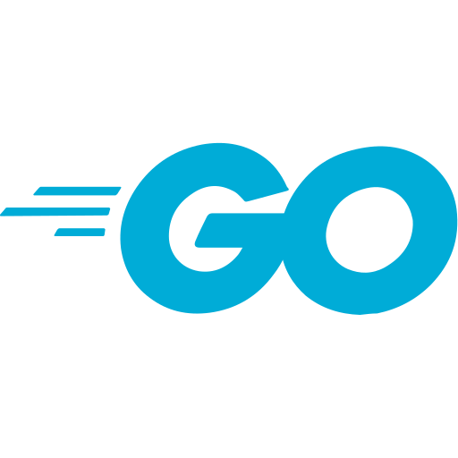

<h1 align="center">
    
    
Todolist - Go + React

</h1>

## ⭐ ABOUT

A to-do list using **Go, React, MongoDB, and Chakra UI**.

## 🔨 TOOLS

- [Go](https://go.dev/)
- [React](https://reactjs.org/)
- [Chakra UI](https://chakra-ui.com/)
- [Mongodb](https://www.mongodb.com/)
- [Bun](https://bun.sh/)

## ✨ GETTING STARTED

Code in production:
https://gotodo-production.up.railway.app/